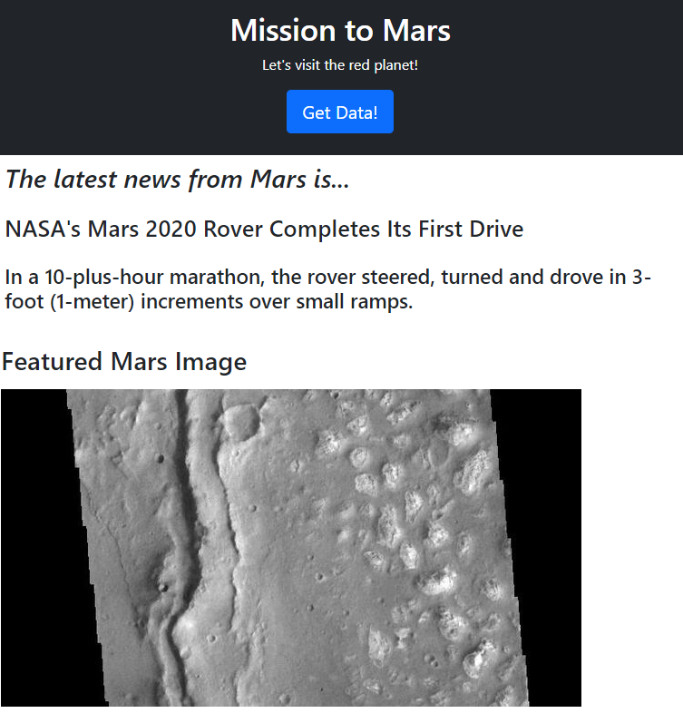
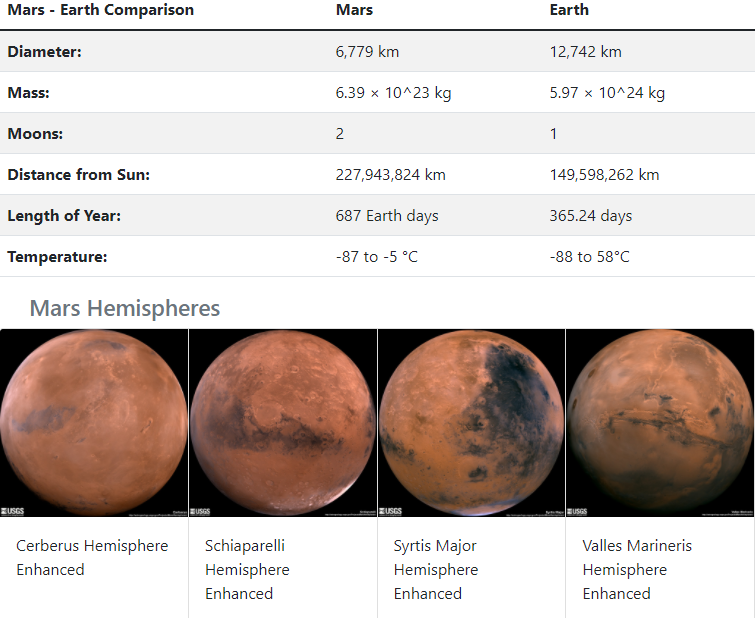

# Web Scraping Challenge - Mission to Mars!

For this project, we pull together different types of information from various web sites and compile it, then show it together in a web site rendering.

The following tasks were exercised for this challenge:

* Beautiful Soup, Selenium, Splinter used to pull the first headline and paragraph from redplanetscience.com  
* The featured image from spaceimages-mars.com was captured  
* The Mars facts table from galaxyfacts-mars.com was pulled using Pandas  
* Pictures of each of Mars hemispheres were captured from marshemispheres.com  
* Jupyter Notebook code was converted to a Python script and set as a scrape function  
* The dictionary of captured information was passed to MongoDB using a Flask instance  
* Flask pulled the data from the MongoDB and rendered the information in a web page using index.html and Bootstrap  

